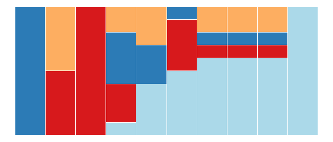
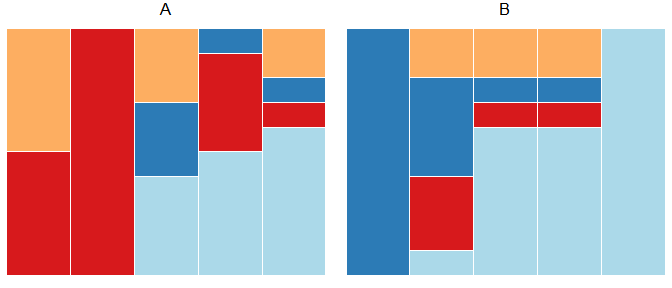

<!-- README.md is generated from README.Rmd. Please edit that file -->

# FAVA

<!-- badges: start -->
<!-- badges: end -->

FAVA (Fst-based Assessment of Variability over relative Abundances) is a
suite of tools to quantify and compare the variability of compositional
datasets (i.e., matrices with rows that sum to 1). Included functions
simulate random compositional data, plot compositional data using
ggplot2, and calculate Fst, Fst weighted by distances between rows
and/or pairwise similarity among columns, and Fst/FstMax (a normalized
measure of variability). They also can generate bootstrap replicates of
one or more compositional datasets along with associated statistics.
This package accompanies the paper ‘’PAPER TITLE HERE’’ by Maike
Morrison, AND OTHERS. You can access the paper in NICE JOURNAL at this
link: <https://doi.org/>….

## Installation

You can install the development version of FAVA from
[GitHub](https://github.com/) with:

``` r
# install.packages("devtools")
devtools::install_github("MaikeMorrison/FAVA")
```

## Help

``` r
library(FAVA)
?fst
?fst_norm
?het
?hetMean
?hetPooled
?Q_plot
```

## Example

``` r

Q = cbind(data.frame(population = c(rep("A", 5), rep("B", 5))),
          matrix(c(1.0, 0.0, 0.0, 0.0,
                   0.5, 0.5, 0.0, 0.0,
                   0.1, 0.2, 0.6, 0.1,
                   0.4, 0.0, 0.5, 0.1,
                   0.0, 0.3, 0.4, 0.3,
                   0.0, 0.0, 1.0, 0.0,
                   0.1, 0.2, 0.6, 0.1,
                   0.0, 0.0, 0.0, 1.0,
                   0.1, 0.2, 0.6, 0.1,
                   0.3, 0.2, 0.1, 0.4), 
                 byrow = TRUE, ncol = 4))

Q
#>    population   1   2   3   4
#> 1           A 1.0 0.0 0.0 0.0
#> 2           A 0.5 0.5 0.0 0.0
#> 3           A 0.1 0.2 0.6 0.1
#> 4           A 0.4 0.0 0.5 0.1
#> 5           A 0.0 0.3 0.4 0.3
#> 6           B 0.0 0.0 1.0 0.0
#> 7           B 0.1 0.2 0.6 0.1
#> 8           B 0.0 0.0 0.0 1.0
#> 9           B 0.1 0.2 0.6 0.1
#> 10          B 0.3 0.2 0.1 0.4

# Plot

palette = RColorBrewer::brewer.pal(4, "RdYlBu")
names(palette) <- paste0("q", 1:4)

Q_plot(Q = Q, K = 4, arrange = FALSE) + 
  ggplot2::scale_color_manual(values = rep("white", 4)) + 
  ggplot2::scale_fill_manual(values = palette)
```


``` r

Q_plot(Q = Q, K = 4, arrange = TRUE)+ 
  ggplot2::scale_color_manual(values = rep("white", 4)) + 
  ggplot2::scale_fill_manual(values = palette)
```



``` r

Q_plot(Q = Q, K = 4, arrange = TRUE, group = "population")+ 
  ggplot2::scale_color_manual(values = rep("white", 4)) + 
  ggplot2::scale_fill_manual(values = palette)
```



``` r

# Unweighted Fst
fst(Q[1:5,2:5])
#> [1] 0.3371429
fst(Q[6:10,2:5])
#> [1] 0.4377267


# Weighted Fst

similarity_matrix = diag(4)
similarity_matrix[2,3] = similarity_matrix[3,2] = 0.8
similarity_matrix[1,3] = similarity_matrix[3,1] = 0.6

similarity_matrix
#>      [,1] [,2] [,3] [,4]
#> [1,]  1.0  0.0  0.6    0
#> [2,]  0.0  1.0  0.8    0
#> [3,]  0.6  0.8  1.0    0
#> [4,]  0.0  0.0  0.0    1

w = c(0.2, 0.3, 0.1, .3, .1)


fst(Q = Q[1:5,2:5], w = w, S = similarity_matrix)
#> [1] 0.2460064
fst(Q = Q[6:10,2:5], w = w, S = similarity_matrix)
#> [1] 0.3954467
```
